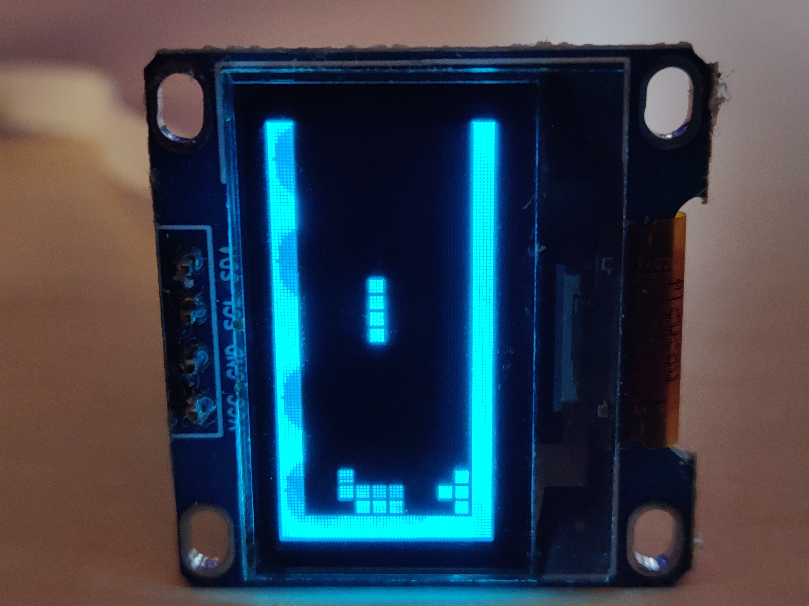
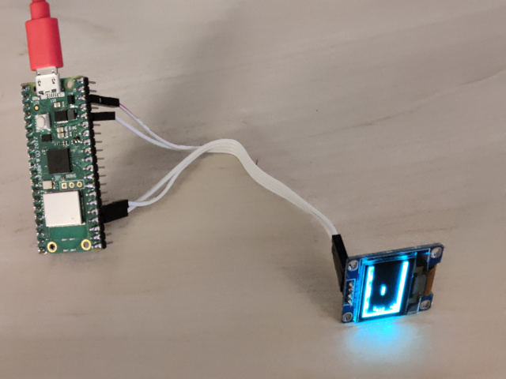

PiCoTetris
-----------


# Introduction
Rasberry pico (w) based Tetris like game (WIP)

First version is using a SSD106 Oled display connected to pins 24&25 (I2C1)
(Adaptation to other display is easy by implemeting the DisplayDriver interface)

Control is done with serial over USB using a terminal (like minicom for linux).
Controls:
    'q'  : left
    's'  : down
    'd'  : right
    space: rotate

 

# Compilation
Needs:
- [pico-sdk](https://github.com/raspberrypi/pico-sdk)

```
$ mkdir build
$ cd build
$ cmake -DPICO_BOARD=pico_w ..
$ make
```

# Installation
- Copy uf2 file to the pico or use picotool: 
```
sudo picotool load -f -x PiCoTetris.uf2 
```

